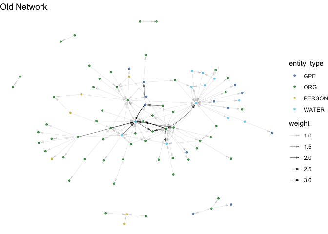
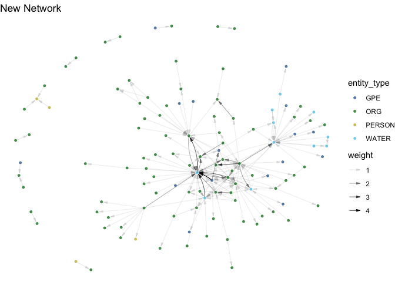
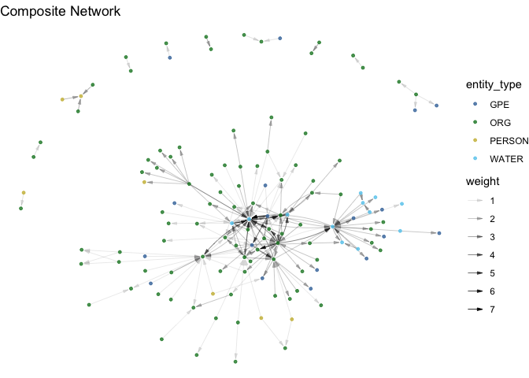
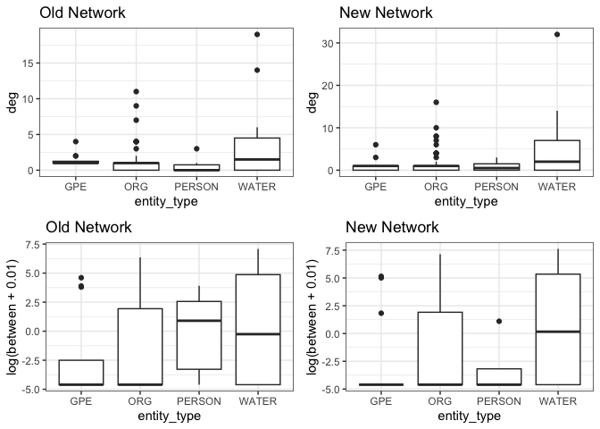

## Introduction

Network measurement in social science typically relies on data collected
through surveys and interviews. Document-based measurement is
automatable and scalable, providing opportunities for large scale or
longitudinal research that are not possible through traditional methods.
A number of tools exist to generate networks based on co-occurrence of
words within documents (such as the
[Nocodefunctions](https://nocodefunctions.com/cowo/semantic_networks_tool.html)
app [@levallois_translating_2012], the
[“textnets”](https://github.com/cbail/textnets) package [@bail_cbailtextnets_2024],
[InfraNodus](https://infranodus.com/) [@paranyushkin_infranodus_2018], and many
more). But there is, to our knowledge, no open-source tool that
generates network data based on the syntactic relationships between
entities within a sentence. *textNet* allows a user to input one or more
PDF documents and create arbitrarily complex directed, multiplex, and
multimodal network graphs. *textNet* also works on arbitrarily long
documents, making it well suited for research applications using long
texts such as government planning documents, court proceedings,
regulatory impact analyses, and environmental impact assessments.

## Statement of Need

Network extraction from documents has typically required manual coding.
Furthermore, existing network extraction methods that use co-occurrence
leave a vast amount of data on the table, namely, the rich edge
attribute data and directionality of each verb phrase defining the
particular relationship between two entities, and the respective roles
of the entity nodes involved in that verb phrase. We present an R
package, *textNet*, designed to enable directed, multiplex, multimodal
network extraction from text documents through syntactic dependency
parsing, in a replicable, automated fashion for collections of
arbitrarily long documents. The *textNet* package facilitates the
automated analysis and comparison of many documents, based on their
respective network characteristics. Its flexibility allows for any
desired entity categories, such as organizations, geopolitical entities,
dates, or custom-defined categories, to be preserved.

### Directed Graph Production

As a syntax-based network extractor, *textNet* identifies source and
target nodes. This produces directed graphs that contain information
about network flow. Methods based on identifying co-occurring nodes in a
document, by contrast, produce undirected graphs. textNet also allows
the user to code ties based on co-occurrence in a designated piece of
text if desired.

### Multiplex Graph Output

Syntax-based measurement encodes edges based on subject-verb-object
relationships. *textNet* stores verb information as edge attributes,
which allows the user to preserve arbitrarily complex topological layers
(of different types of relationships) or customize groupings of edge
types to simplify representation.

### Multimodal Graph Output

Multimodal networks, or networks where there are multiple categories of
nodes, have common use cases such as social-ecological network analysis
of configurations of actors and environmental features. Existing
packages such as the manynet package [@hollway_manynet_2024] provide analytical
functions for multimodal network statistics. *textNet* provides a
structure for tagging and organizing arbitrarily complex node labeling
schemes that can then be fed into packages for multi-node network
statistical analysis. Node labels can be automated (e.g., the default
entity type tags for an NLP engine such as *spaCy* [@honnibal_spacy_2021]), customized using a dictionary, or based on a hybrid scheme of
default and custom labels. Any node type is possible (e.g., species,
places, people, concepts, etc.) so this can be adapted to domain
specific research applications by applying dictionaries or using a
custom NER model.

### Avoids Saturation

Co-occurrence graphs have the tendency to generate saturated subgraphs,
since every co-occurring collection of entities has every possible edge
drawn amongst them. By contrast, *textNet* draws connections not between
every entity in the document or even the sentence, but specifically
between pairs of entities that are mediated by an event relationship.
This leads to sparser graphs that preserve the ability for greater
structural variance, and correspondingly, network analysis of structural
attributes of the graphs.

## Installation

The stable version of this package can be installed from Github, using
the *devtools* package [@wickham_devtools_2022]:

    devtools::install_github("ucd-cepb/textnet")

The *textNet* package suggests several convenience wrappers of packages
such as *spacyr* [@benoit_spacyr_2023], *pdftools* [@ooms__aut_pdftools_2024], *igraph* [@csardi_igraph_2024], and *network* [@butts_network_2023].
To use the full functionality of *textNet*, such as pre-processing tools
and post-processing analysis tools, we recommend installing these
packages, which for *spacyr* requires integration with Python. However,
the user may wish to preprocess and parse data using their own NLP
engine, and skip directly to the textnet\_extract() function, which does
not depend on any of the aforementioned packages. The textnet\_extract()
function does, however, use functions from *pbapply* [@solymos_pbapply_2023], *data\_table* [@barrett_datatable_2024], *dplyr* [@wickham_dplyr_2023], and *tidyr* [@wickham_tidyr_2024].

## Overview and Main Functions

The package architecture relies on four sets of functions around core
tasks:

- \[OPTIONAL\] Pre-processing: pdf\_clean(), a wrapper for the
pdftools::pdf\_text() function which includes a custom header/footer
text removal feature; and parse\_text(), which is a wrapper for the
*spacyr* package and uses the *spaCy* natural language processing engine
[@honnibal_spacy_2021] to parse text and perform part of speech tagging, dependency
parsing, and named entity recognition (NER). Alternatively, as described
below, the user can skip this step and load parsed text directly into
the package.
- Network extraction: textnet\_extract(), which generates a graph
database from parsed text based upon tags and dependency relations
- Disambiguation: tools for cleaning, recoding, and aggregating node and
edge attributes, such as the find\_acronyms() function, which can be
paired with the disambiguation() function to identify acronyms in the
text and replace them with the full entity name.
- Exploration: the export\_to\_network() function for exporting the
graph database to igraph and network objects, top\_features() for
viewing node and edge attributes, and combine\_networks() for
aggregating multiple document-based graphs based on common nodes.

## Example

The following example uses parsed text from the Gravelly Ford Water
District Groundwater Sustainability Plan in the state of California,
before and after the plan underwent revisions required by the California
Department of Water Resources. Both versions of the plan were
pre-processed using the optional pdf\_clean() and parse\_text()
functions, as shown in the appendix below and package repository.
*textNet* is designed for modularity with respect to pdf-to-text
conversion and NLP engine. The user can derive plain text by any
approach, and likewise perform event extraction with any NLP engine or
large language model (LLM) (more on LLM extensions below) and bring
these data to *textNet*. The textnet\_extract() function expects the
parsed table to follow specific conventions for column names and speech
tagging, so externally produced data must be converted to standards
outlined in the package manual.

### Extract Networks

First, we read in the pre-processed data and call textnet\_extract() to
produce the network object:

    library(textNet)
    old_new_parsed <- textNet::old_new_parsed

    extracts <- vector(mode="list",length=length(old_new_parsed))
       for(m in 1:length(old_new_parsed)){
          extracts[[m]] <- textnet_extract(old_new_parsed[[m]],
                  concatenator="_",cl=4,
                  keep_entities = c('ORG','GPE','PERSON','WATER'), 
                  return_to_memory=T, keep_incomplete_edges=T)
       }

    ## [1] "crawling 802 sentences"
    ## [1] "crawling 1090 sentences"

The textnet\_extract() function extracts the entity network. It reads in
the result of parse\_text() as described in the appendix, or another
parsing tool with appropriate column names and tagging conventions. The
resulting object consists of a nodelist, an edgelist, a verblist, and a
list of appositives. The nodelist variables are entity\_name, the
concatenated name of the entity; entity\_type, which is a preservation
from the entity\_type attribute from the output of
textNet::parse\_text(); and num\_appearances, which is the number of
times the entity appears in the PDF text. (This is not the same as node
degree, since there may be multiple edges, or if keep\_incomplete\_edges
is set to false, no edges resulting from a single appearance of the
entity in the document.) The entity\_type attribute represents *spaCy*’s
determination of entity type using its NER recognition, or if a custom
parser or NER tool is used, the textnet\_extract() function will
preserve these entity type designations.

The file is saved to the provided filename, if provided. It is returned
to memory if return\_to\_memory is set to T. At least one of these
return pathways must be established to avoid an error. In this example,
we only keep entity types in the nodelist, edgelist, and appositivelist
that are listed under keep\_entities; namely, “ORG”, “GPE”, “PERSON”,
and “WATER”.

The resulting object consists of a nodelist, an edgelist, a verblist,
and a list of appositives. The nodelist variables are entity\_name, the
concatenated name of the entity; entity\_type, which is a preservation
from the entity\_type attribute from the output of
textNet::parse\_text(); and num\_appearances, which is the number of
times the entity appears in the PDF text. The default entity types are
based on *spaCy*’s NER tags, but entity types can be customized as
desired. In this example, we only keep entity types in the nodelist,
edgelist, and appositivelist that are listed under keep\_entities;
namely, “ORG”, “GPE”, “PERSON”, and “WATER”.

### Consolidate Entity Synonyms

In a document, the same real-world entity may be referenced in multiple
ways. For instance, the document may introduce an organization using its
full name, then use an acronym for the remainder of the document. To
have more reliable network results, it is important to consolidate nodes
that represent different naming conventions into a single node. The
*textNet* package comes with a built-in tool for finding acronyms
defined parenthetically within the text. This can be run on the result
of pdf\_clean() to generate a table with one column for acronyms and
another for the corresponding full names, such that each row is a
different instance of a phrase for which an acronym was detected. The
use of find\_acronyms() is demonstrated below.

       old_new_text <- textNet::old_new_text
       old_acronyms <- find_acronyms(old_new_text[[1]])
       new_acronyms <- find_acronyms(old_new_text[[2]])
       
       print(head(old_acronyms))

    ##                              name acronym
    ##                            <char>  <char>
    ## 1:                 Central_Valley      CV
    ## 2:         Total_Dissolved_Solids     TDS
    ## 3: California_Code_of_Regulations     CCR
    ## 4:  Department_of_Water_Resources     DWR
    ## 5:       Best_Management_Practice     BMP
    ## 6:   Gravelly_Ford_Water_District    GFWD

The resulting table of acronyms can then be fed into a disambiguation
tool, the *textNet* function disambiguate(). This tool is very flexible,
allowing a user-defined custom vector or list of strings representing
the original entity name to search for in the textnet\_extract object,
and another user-defined custom vector or list of strings representing
the entity name to which to convert those instances. Additional inputs
that may be useful here are names and abbreviations of known federal and
state or regional agencies, or other entities that are likely to be
discussed in the particular type of document being analyzed. There may
also be topic-specific words or phrases that are likely to be discussed
in the document. For instance, in Groundwater Sustainability Plans, it
is common to discuss entities that involve the term “subbasin,” but the
spelling of this is not always consistent.

In the example below, we define a “from” vector that includes the
acronyms found through the previous step, as well as non-standard
spellings of “subbasin.” This function is case sensitive, so we have
included two alternate cases that are likely to appear in the dataset.
The “to” vector includes the full names from the find\_acronyms result,
along with the standard spelling of “subbasin”.

There are a few rules about defining the “from” and “to” columns. First,
the length of “from” and “to” must be identical, since from\[\[i\]\] is
replaced with to\[\[i\]\]. Second, there may not be any duplicated terms
in the “from” list, since each string must be matched to a single
replacement without ambiguity. It is acceptable to have duplicated terms
in the “to” list.

The “from” argument may be formatted as either a vector or a list.
However, if it is a list, no element may contain more than one string.
The “match\_partial\_entity” argument defaults to F for each element of
“from” and “to.” However, it can be set to T or F for each individual
element. (Replacing an acronym with its full name may only be wise if
the entire name of the node is that acronym. Otherwise “EPA” could
accidentally match on “NEPAL” and create a nonsense entity called
“NEnvironmental\_Protection\_AgencyL”. The risk of this for modern,
sentence-case documents is decreased, as disambiguate() is intentionally
a case-sensitive function.) For the example below, we set
match\_partial\_entity to F for each of the acronyms, but to T for the
word “Sub\_basin,” since “Sub\_basin” may very well be a portion of a
longer entity, for which we would want to standardize the spelling.

Each element in the “from” object must be a single character vector.
This is not the case for the “to” argument; a user may define elements
of “to” to contain multiple character vectors in order to convert a
single node into multiple nodes. Specifically, there may be some cases
in which one would want to convert a single node into multiple nodes,
each preserving the original node’s edges to other nodes. For instance,
suppose a legal document refers to “The\_Defendants” as a shorthand for
referring to three individuals involved in the case. In the network, it
may be desirable for these individuals to be represented as their own
separate nodes, especially if the network is to be merged with those
resulting from other documents, where the three defendants may be named
separately. To convert this single node into multiple nodes that
preserve all of their original edges to other entities, from\[\[j\]\]
should be set to “The\_Defendants”, and to\[\[j\]\] should be set to a
string vector including the individuals’ names, such as c(“John\_Doe”,
“Jane\_Doe”, “Emily\_Doe”).

The default behavior is to loop through the disambiguation recursively,
though by setting recursive to F, this can be overridden. The difference
can be seen in the following example. Suppose that the following from
list and to list are defined: from = c(“MA”,“Mass”); to =
c(“Mass”,“Massachusetts”). If recursive = F, all instances of MA in the
original textnet\_extract object would be set to Mass, and all instances
of Mass in the original textnet\_extract object would be set to
Massachusetts. If recursive = T, all instances of MA and Mass in the
original textnet\_extract object would be set to Massachusetts. The
ability to toggle this behavior can be useful when concatenating a large
from and to list based on multiple sources.

The disambiguate() function is designed to be usable even for very large
graphs; when disambiguating thousands of nodes, a user may choose to use
web scraping or another automated tool to help generate a long list of
“from” and “to” elements by which to merge or separate the nodes of the
graph. Use of an automated tool to generate “to” and “from” columns with
hundreds or thousands of elements can lead to uncertainty about the
behavior of the “to” and “from” columns. Such problems are anticipated
and resolved automatically by the function. For instance, the function
resolves loops such as from = c(“hello”,“world”); to =
c(“world”,“hello”) automatically, with a warning summarizing the rows
that were removed. It also resolves loops resulting from poorly
specified partial matching rules on the part of the user. This is the
only tool we are aware of that can help users troubleshoot user-defined
rules governing node merging and separation.

The textnet\_extract argument of disambiguate() accepts the result of
the textnet\_extract() function. The object returned by disambiguate()
updates the edgelist$source column, edgelist$target column, and
nodelist$entity\_name column to reflect the new node names.

Information about the optional argument try\_drop can be found in the
package documentation. When specified, the function merges nodes that
differ only by the regex phrase specified by try\_drop, and which become
identical upon removal of the regular expression encoded in try\_drop.

    tofrom <- data.table::data.table(
       from = c(as.list(old_acronyms$acronym),
                 list("Sub_basin",
                      "Sub_Basin",
                      "upper_and_lower_aquifers",
                      "Upper_and_lower_aquifers",
                      "Lower_and_upper_aquifers",
                      "lower_and_upper_aquifers")), 
       to = c(as.list(old_acronyms$name),
                 list("Subbasin",
                      "Subbasin",
                      c("upper_aquifer","lower_aquifer"),
                      c("upper_aquifer","lower_aquifer"),
                      c("upper_aquifer","lower_aquifer"),
                      c("upper_aquifer","lower_aquifer"))))

       old_extract_clean <- disambiguate(
          textnet_extract = extracts[[1]],
          from = tofrom$from, 
          to = tofrom$to,
          match_partial_entity = c(rep(F,nrow(old_acronyms)),T,T,F,F,F,F))
       
       tofrom <- data.table::data.table(
       from = c(as.list(new_acronyms$acronym),
                 list("Sub_basin",
                      "Sub_Basin",
                      "upper_and_lower_aquifers",
                      "Upper_and_lower_aquifers",
                      "Lower_and_upper_aquifers",
                      "lower_and_upper_aquifers")), 
       to = c(as.list(new_acronyms$name),
                 list("Subbasin",
                      "Subbasin",
                      c("upper_aquifer","lower_aquifer"),
                      c("upper_aquifer","lower_aquifer"),
                      c("upper_aquifer","lower_aquifer"),
                      c("upper_aquifer","lower_aquifer"))))
       
       new_extract_clean <- disambiguate(
          textnet_extract = extracts[[2]], 
          from = tofrom$from, 
          to = tofrom$to,
          match_partial_entity = c(rep(F,nrow(new_acronyms)),T,T,F,F,F,F))

### Get Network Attributes

A tool that generates an igraph or network object from the
textnet\_extract output is included in the package as the function
export\_to\_network(). It returns a list that contains the igraph or
network itself as the first element, and an attribute table as the
second element. Functions from the *sna* (Butts 2024), *igraph* (Csárdi
et al. 2024), and *network* packages (Butts et al. 2023) are invoked to
create a network attribute table of common network-level attributes; see
package documentation for details.

       old_extract_net <- export_to_network(old_extract_clean, "igraph", 
               keep_isolates = F, collapse_edges = F, self_loops = T)
       new_extract_net <- export_to_network(new_extract_clean, "igraph", 
               keep_isolates = F, collapse_edges = F, self_loops = T)

       table <- t(format(rbind(old_extract_net[[2]], new_extract_net[[2]]), 
               digits = 3, scientific = F))
       colnames(table) <- c("old","new")
       print(table)

    ##                          old      new     
    ## num_nodes                " 88"    "118"   
    ## num_edges                "163"    "248"   
    ## connectedness            "0.710"  "0.677" 
    ## centralization           "0.207"  "0.325" 
    ## transitivity             "0.109"  "0.153" 
    ## pct_entitytype_homophily "0.503"  "0.581" 
    ## reciprocity              "0.245"  "0.306" 
    ## mean_in_degree           "1.85"   "2.10"  
    ## mean_out_degree          "1.85"   "2.10"  
    ## median_in_degree         "1"      "1"     
    ## median_out_degree        "1"      "1"     
    ## modularity               "0.542"  "0.522" 
    ## num_communities          "12"     "16"    
    ## percent_vbn              "0.374"  "0.423" 
    ## percent_vbg              "0.0736" "0.0524"
    ## percent_vbp              "0.1288" "0.0766"
    ## percent_vbd              "0.0675" "0.0685"
    ## percent_vb               "0.135"  "0.137" 
    ## percent_vbz              "0.221"  "0.242"

The *ggraph* package (Pedersen and RStudio 2024) has been used to create
the two network visualizations seen here, using a weighted version of
the igraphs constructed below. We set collapse\_edges = T to convert the
multiplex graph into its weighted equivalent.

       library(ggraph)

    ## Warning: package 'ggraph' was built under R version 4.3.2

    ## Loading required package: ggplot2

    ## Warning: package 'ggplot2' was built under R version 4.3.2

       old_extract_plot <- export_to_network(old_extract_clean, "igraph", 
               keep_isolates = F, collapse_edges = T, self_loops = T)[[1]]
       new_extract_plot <- export_to_network(new_extract_clean, "igraph", 
               keep_isolates = F, collapse_edges = T, self_loops = T)[[1]]
       #order of these layers matters
       ggraph(old_extract_plot, layout = 'fr')+
          geom_edge_fan(aes(alpha = weight),
                        end_cap = circle(1,"mm"),
                        color = "#000000",
                        width = 0.3,
                        arrow = arrow(angle=15,length=unit(0.07,"inches"),
                                ends = "last",type = "closed"))+
          #from Paul Tol's bright color scheme
          scale_color_manual(values = c("#4477AA","#228833","#CCBB44","#66CCEE"))+
          geom_node_point(aes(color = entity_type), size = 1,
                          alpha = 0.8)+
          labs(title= "Old Network")+
          theme_void()

       #order of these layers matters
       ggraph(new_extract_plot, layout = 'fr')+
          geom_edge_fan(aes(alpha = weight),
                        end_cap = circle(1,"mm"),
                        color = "#000000",
                        width = 0.3,
                        arrow = arrow(angle=15,length=unit(0.07,"inches"),
                                ends = "last",type = "closed"))+
          #from Paul Tol's bright color scheme
          scale_color_manual(values = c("#4477AA","#228833","#CCBB44","#66CCEE"))+
          geom_node_point(aes(color = entity_type), size = 1,
                          alpha = 0.8)+
          labs(title= "New Network")+
          theme_void()

### Explore Edge Attributes

The top\_features() tool calculates the most common verbs across the
entire corpus of documents, as shown below.

       top_feats <- top_features(list(old_extract_net[[1]], new_extract_net[[1]]))
       head(top_feats[[2]],10)

    ## # A tibble: 10 × 2
    ##    names   avg_fract_of_a_doc
    ##    <chr>                <dbl>
    ##  1 be                  0.104 
    ##  2 include             0.0844
    ##  3 provide             0.0661
    ##  4 locate              0.0519
    ##  5 result              0.0407
    ##  6 base                0.0274
    ##  7 receive             0.0254
    ##  8 show                0.0224
    ##  9 develop             0.0212
    ## 10 make                0.0203

Using a syntax-based extraction technique enables the preservation of a
rich set of edge attributes giving insight into the nature of the
relationship between each pair of nodes. The edge attributes
“head\_verb\_name” and “head\_verb\_lemma,” respectively, indicate the
verb and infinitive form of the verb mediating the relationship between
the source and target nodes. The edge attributes “helper\_token” and
“helper\_lemma” indicate the presence of a helping verb in the verb
phrase, while the edge attributes “xcomp\_helper\_lemma” and
“xcomp\_helper\_token” indicate the presence of an open causal
complement in the verb phrase. Open causal complements, such as
“monitor” in the sentence “The agency is expected to monitor the
results,” can provide key supplemental information about the
relationship between the source and target nodes. Additional edge
attributes include indicators for verb tense and the presence of
uncertain “hedging” language in the sentence. Other edge attributes
travel with the edge to document where in the document, and in which
document, the edge occurs. For instance, we can summarize the verb tense
of edges in the original plan in a table. The abbreviations follow [Penn
Treebank](https://catalog.ldc.upenn.edu/docs/LDC99T42/) classifications
[@marcus_treebank-3_1999], such that VB = base form, VBD = past tense, VBG =
gerund or present participle, VBN = past participle, VBP = non-3rd
person singular present, and VBZ = 3rd person singular present. The most
common verb tense used in the plan was VBN, or past participle.

       table(igraph::E(old_extract_net[[1]])$head_verb_tense)

    ## 
    ##  VB VBD VBG VBN VBP VBZ 
    ##  22  11  12  61  21  36

### Generate Composite Network

The combine\_networks function allows a composite network to be
generated from multiple export\_to\_network() outputs. This function is
useful for understanding and analyzing the overlaps between the network
of multiple documents. In this example, a composite network is not as
useful, since these documents are not from two different regions being
discussed but rather are two versions of the same document. However, for
illustration purposes, the composite network is generated below.

For best results, composite network generation should not be done
without an adequate disambiguation in Step 4. A function is included
that merges the edgelists and nodelists of all documents. If the same
node name is mentioned in multiple documents, the node attributes
associated with the highest total number of edges for that node name are
preserved.

       composite_net <- combine_networks(list(old_extract_net[[1]],
               new_extract_net[[1]]), mode = "weighted")
       ggraph(composite_net, layout = 'fr')+
          geom_edge_fan(aes(alpha = weight),
                        end_cap = circle(1,"mm"),
                        color = "#000000",
                        width = 0.3,
                        arrow = arrow(angle=15,length=unit(0.07,"inches"),
                                ends = "last",type = "closed"))+
          #from Paul Tol's bright color scheme
          scale_color_manual(values = c("#4477AA","#228833","#CCBB44","#66CCEE"))+
          geom_node_point(aes(color = entity_type), size = 1,
                          alpha = 0.8)+
          labs(title= "Composite Network")+
          theme_void()

### Explore Node Attributes

The network objects generated from export\_to\_network can be used to
analyze the node attributes of the graphs. Below we demonstrate several
node attribute exploration tools. First, we use the the top\_features()
function to calculate the most common entities across the entire corpus
of documents.

    library(network)
    library(igraph)

       top_feats <- top_features(list(old_extract_net[[1]], new_extract_net[[1]]))
       print(head(top_feats[[1]],10))

    ## # A tibble: 10 × 2
    ##    names                                         avg_fract_of_a_doc
    ##    <chr>                                                      <dbl>
    ##  1 groundwater                                               0.180 
    ##  2 gsa                                                       0.0803
    ##  3 san_joaquin_river                                         0.0692
    ##  4 gfwd_gsa                                                  0.0452
    ##  5 surface_water                                             0.0426
    ##  6 gravelly_ford_water_district                              0.0386
    ##  7 subbasin                                                  0.0381
    ##  8 gsp                                                       0.0293
    ##  9 madera_subbasin                                           0.0259
    ## 10 north_kings_groundwater_sustainability_agency             0.0254

Next, we calculate node-level attributes on a weighted version of the
networks. First we prepare the data frames for both the old and new
networks. We can include the variable num\_graphs\_in from our composite
network to investigate what kinds of nodes are found in both plans.

        composite_tbl <- igraph::as_data_frame(composite_net, what = "vertices")
        composite_tbl <- composite_tbl[,c("name","num_graphs_in")]
        
        #prepare data frame version of old network, to add composite_tbl variables
        old_tbl <- igraph::as_data_frame(old_extract_net[[1]], what = "both")
        #this adds the num_graphs_in variable from composite_tbl
        old_tbl$vertices <- dplyr::left_join(old_tbl$vertices, composite_tbl)

    ## Joining with `by = join_by(name)`

        #turn back into a network
        old_net <- network::network(x=old_tbl$edges[,1:2], directed = T,
                              hyper = F, loops = T, multiple = T, 
                              bipartiate = F, vertices = old_tbl$vertices,
                              matrix.type = "edgelist")
        #we need a matrix version for some node statistics
        old_mat <- as.matrix(as.matrix(export_to_network(old_extract_clean, 
                "igraph", keep_isolates = F, collapse_edges = T, self_loops = F)[[1]]))
        
        #prepare data frame version of new network, to add composite_tbl variables
        new_tbl <- igraph::as_data_frame(new_extract_net[[1]], what = "both")
        #this adds the num_graphs_in variable from composite_tbl
        new_tbl$vertices <- dplyr::left_join(new_tbl$vertices, composite_tbl)

    ## Joining with `by = join_by(name)`

        #turn back into a network
        new_net <- network::network(x=new_tbl$edges[,1:2], directed = T,
                              hyper = F, loops = T, multiple = T, 
                              bipartiate = F, vertices = new_tbl$vertices,
                              matrix.type = "edgelist")
        #we need a matrix version for some node statistics
        new_mat <- as.matrix(as.matrix(export_to_network(new_extract_clean, 
                "igraph", keep_isolates = F, collapse_edges = T, self_loops = F)[[1]]))

We can now use these data structures to calculate node statistics, as
printed below.

        paths2 <- diag(old_mat %*% old_mat)
        recip <- 2*paths2 / sna::degree(old_net)
        totalCC <- as.vector(unname(DirectedClustering::ClustF(old_mat, 
                type = "directed", isolates="zero")$totalCC))
        closens <- sna::closeness(old_net, gmode = "graph", cmode="suminvundir")
        between <- sna::betweenness(old_net,gmode = "graph",cmode="undirected")
        deg <- sna::degree(old_net, gmode = "graph", cmode = "undirected")
        old_node_df <- dplyr::tibble(name = network::get.vertex.attribute(old_net, 
                  "vertex.names"), 
                  closens, 
                  between, 
                  deg,
                  recip,
                  totalCC,
                  entity_type = network::get.vertex.attribute(old_net,"entity_type"),
                  num_graphs_in = network::get.vertex.attribute(old_net, "num_graphs_in"))
        

        paths2 <- diag(new_mat %*% new_mat)
        recip <- 2*paths2 / sna::degree(new_net)
        totalCC <- as.vector(unname(DirectedClustering::ClustF(new_mat, 
                type = "directed", isolates="zero")$totalCC))
        closens <- sna::closeness(new_net, gmode = "graph", cmode="suminvundir")
        between <- sna::betweenness(new_net,gmode = "graph",cmode="undirected")
        deg <- sna::degree(new_net, gmode = "graph", cmode = "undirected")
        new_node_df <- dplyr::tibble(name = network::get.vertex.attribute(new_net, 
                  "vertex.names"), 
                  closens, 
                  between, 
                  deg,
                  recip,
                  totalCC,
                  entity_type = network::get.vertex.attribute(new_net,"entity_type"),
                  num_graphs_in = network::get.vertex.attribute(new_net, "num_graphs_in"))
        
        summary(old_node_df)

    ##      name              closens           between             deg       
    ##  Length:88          Min.   :0.01149   Min.   :   0.00   Min.   : 0.00  
    ##  Class :character   1st Qu.:0.25465   1st Qu.:   0.00   1st Qu.: 0.00  
    ##  Mode  :character   Median :0.30134   Median :   0.00   Median : 1.00  
    ##                     Mean   :0.26573   Mean   :  62.41   Mean   : 1.67  
    ##                     3rd Qu.:0.32217   3rd Qu.:  19.66   3rd Qu.: 1.00  
    ##                     Max.   :0.51149   Max.   :1191.82   Max.   :19.00  
    ##      recip           totalCC         entity_type        num_graphs_in  
    ##  Min.   :0.0000   Min.   :0.000000   Length:88          Min.   :1.000  
    ##  1st Qu.:0.0000   1st Qu.:0.000000   Class :character   1st Qu.:2.000  
    ##  Median :0.0000   Median :0.000000   Mode  :character   Median :2.000  
    ##  Mean   :0.0518   Mean   :0.080564                      Mean   :1.864  
    ##  3rd Qu.:0.0000   3rd Qu.:0.003472                      3rd Qu.:2.000  
    ##  Max.   :1.0000   Max.   :1.000000                      Max.   :2.000

        summary(new_node_df)

    ##      name              closens            between              deg       
    ##  Length:118         Min.   :0.008547   Min.   :   0.000   Min.   : 0.00  
    ##  Class :character   1st Qu.:0.232087   1st Qu.:   0.000   1st Qu.: 0.00  
    ##  Mode  :character   Median :0.282051   Median :   0.000   Median : 1.00  
    ##                     Mean   :0.246142   Mean   :  82.712   Mean   : 1.78  
    ##                     3rd Qu.:0.309829   3rd Qu.:   6.022   3rd Qu.: 1.00  
    ##                     Max.   :0.512821   Max.   :2025.067   Max.   :32.00  
    ##      recip            totalCC        entity_type        num_graphs_in  
    ##  Min.   :0.00000   Min.   :0.00000   Length:118         Min.   :1.000  
    ##  1st Qu.:0.00000   1st Qu.:0.00000   Class :character   1st Qu.:1.000  
    ##  Median :0.00000   Median :0.00000   Mode  :character   Median :2.000  
    ##  Mean   :0.04173   Mean   :0.11473                      Mean   :1.644  
    ##  3rd Qu.:0.00000   3rd Qu.:0.08808                      3rd Qu.:2.000  
    ##  Max.   :1.00000   Max.   :1.00000                      Max.   :2.000

The 2x2 table below summarizes the rate at which each entity type is
found in both plans. Very few nodes in the old version (12 out of 88)
are absent from the new version. Conversely, a substantial minority of
nodes in the new version (42 out of 118) are absent from the old
version.

        old_node_df$plan_version <- "old"
        new_node_df$plan_version <- "new"
        combineddf <- rbind(old_node_df, new_node_df)
        with(combineddf,table(plan_version,num_graphs_in))

    ##             num_graphs_in
    ## plan_version  1  2
    ##          new 42 76
    ##          old 12 76

We can also investigate differences in network statistics between the
two plans. For instance, the distribution of degree does not change much
between plan versions. The distribution of betweenness, likewise, is
relatively stable except for person nodes, which are the least common
nodes in the graph.

        library(gridExtra)
        library(ggplot2)
        b1 <- ggplot(old_node_df, aes(x = entity_type, y = deg)) + geom_boxplot() 
                + theme_bw() + labs(title="Old Network")
        b2 <- ggplot(new_node_df, aes(x = entity_type, y = deg)) + geom_boxplot() 
                + theme_bw() + labs(title="New Network")
        b3 <- ggplot(old_node_df, aes(x = entity_type, y = log(between+0.01))) 
                + geom_boxplot() + theme_bw() + labs(title="Old Network")
        b4 <- ggplot(new_node_df, aes(x = entity_type, y = log(between+0.01))) 
                + geom_boxplot() + theme_bw() + labs(title="New Network")

        grid.arrange(b1, b2, b3, b4, ncol=2)

## Potential Further Analyses

The network-level attributes output from export\_to\_network can also be
analyzed against exogenous metadata that has been collected separately
by the researcher regarding the different documents and their real-world
context. The extracted networks, with their collections of verb
attributes, node attributes, edge incidences, and edge attributes, can
also be analyzed through a variety of tools, such as an Exponential
Random Graph Model, to determine the probability of edge formation under
certain conditions. A Temporal Exponential Random Graph Model could also
shed light on the changes of a document over time, such as the multiple
versions of the groundwater sustainability plan in this example.

## Entity Network Extraction Algorithm

The directed network generated by *textNet* represents the collection of
all identified entities in the document, joined by edges signifying the
verbs that connect them. The user can specify which entity categories
should be preserved. The output format is a list containing four
data.tables: an edgelist, a nodelist, a verblist, and an appositive
list.

The edgelist includes edge attributes such as verb tense, any auxiliary
verbs in the verb phrase, whether an open clausal complement (Universal
Dependencies code “xcomp”) is associated with the primary verb, whether
any hedging words were detected in the sentence, and whether any
negations were detected in the sentence.

The returned edgelist by default contains both complete and incomplete
edges. A complete edge includes a source, verb, and target. An
incomplete edge includes either a source or a target, but not both,
along with its associated verb. Incomplete edges convey information
about which entities are commonly associated with different verbs, even
though they do not reveal information about which other entities they
are linked to in the network. These incomplete edges can be filtered out
when converting the output into a network object, such as through the
*network* package or the *igraph* package. The nodelist returns all
entities of the desired types found in the document, regardless of
whether they were found in the edgelist. Thus, the nodelist allows the
presence of isolates to be documented, as well as preserving node
attributes. The verblist includes all of the verbs found in the
document, along with verb attributes imported from *VerbNet*
[@kipper-schuler_verbnet_2006]. This can be used to conduct analyses of certain
verb classifications of interest. Finally, the appositive list is a
table of entities that may be synonyms. This list is generated from
entities whose universal dependency parsing labels as appositives, and
whose head token points to another entity. These pairs are included in
the table as potential synonyms. If this feature is used, cleaning and
filtering by hand is recommended, as appositives can at times be
misidentified by existing NLP tools. An automated alternative we
recommend is our find\_acronym tool, which scans the entire document for
acronyms defined parenthetically in-text and compiles them in a table.

This network is directed such that the entities that form the subject of
the sentence are denoted as the “source” nodes, and the remaining
entities are denoted as the “target” nodes. To identify whether each
entity is a “source” or a “target”, we use dependency parsing in the
Universal Dependencies format, in which each token in a given sentence
has an associated “syntactic head” token from which it is derived.
Starting with each entity in the sentence, the chain of syntactic head
tokens is traced back until either a subject or a verb is reached. If it
reaches a subject first, the entity is considered a “source.” If it
reaches a verb first, it is considered a “target.”

To identify the subject, we search for the presence of at least one of
the following subject tags: “nsubj” (nominal subject), “nsubjpass”
(nominal subject – passive), “csubj” (clausal subject), “csubjpass”
(clausal subject – passive), “agent”, and “expl” (expletive). To
identify the object, we search for the presence of at least one of the
following: “pobj” (object of preposition), “iobj” (indirect object),
“dative”, “attr” (attribute), “dobj” (direct object), “oprd” (object
predicate), “ccomp” (clausal complement), “xcomp” (open clausal
complement), “acomp” (adjectival complement), or “pcomp” (complement of
preposition).

If a subject token is reached first (“nsubj,” “nsubjpass,” “csubj,”
“csubjpass,” “agent,” or “expl”), this indicates that the original token
is doing the verb action. That is, it serves some function related to
the subject of the sentence. We designate this by tagging it “source,”
since these types of relationships will be used to designate the “from”
or “source” nodes in our directed network. If a verb token is reached
first (“VERB” or “AUX”), this indicates that the verb action is
occurring for or towards the original token, which we denote with the
tag “target.” These tokens are potential “to” or “target” nodes in our
directed network. Linking the two nodes is an edge representing the verb
that connects them in the sentence.

Due to the presence of tables, lists, or other anomalies in the original
document, it is possible that a supposed “sentence” has a head token
trail that does not lead to a verb as is normatively the case. In these
instances, the tokens whose trails terminate with a non-subject,
non-verb token are assigned neither “source” nor “target” tags. Finally,
an exception is made if an appositive token is reached first, since this
indicates that the token in question is merely a synonym or restatement
of an entity that is already described elsewhere in the sentence and,
accordingly, should not be treated as a separate node. Tokens that lead
to appositives are assigned neither “source” nor “target” tags, but are
preserved as a separate appositive list.

If a verb phrase in the edgelist does not have any sources, the sources
associated with the head token of the verb phrase’s main verb (that is,
the verb phrase’s parent verb) are adopted as sources of that verb
phrase. As of Version 1.0, *textNet* does not do this recursively, to
preserve performance optimization.

The textNet::textnet\_extract() function returns the full list of open
clausal complement lemmas associated with the main verb as an edge
attribute: “xcomp\_verb”. The list of auxiliary verbs and their
corresponding lemmas associated with the main verb, as well as the list
of auxiliary verbs and corresponding lemmas associated with the open
clausal complements linked to the main verb, are also included as edge
attributes: “helper\_token”, “helper\_lemma”, “xcomp\_helper\_token”,
and “xcomp\_helper\_lemma”, respectively.

The extraction function also detects hedging words and negations. The
function textNet::textnet\_extract() produces an edge attribute
“has\_hedge”, which is T if there is a hedging auxiliary verb
(“may”,“might”,“can”,“could”) or main verb
(“seem”,“appear”,“suggest”,“tend”,“assume”,“indicate”,“estimate”,“doubt”,“believe”)
in the verb phrase.

Tense is also detected. The six tenses tagged by *spaCy* in
textNet::parse\_text() are preserved by textNet::textnet\_extract() as
an edge attribute “head\_verb\_tense”. This attribute can take on one of
six values: “VB” (verb, base form), “VBD” (verb, past tense), “VBG”
(verb, gerund or present participle), “VBN” (verb, past participle),
“VBP” (verb, non-3rd person singular present), or “VBZ” (verb, 3rd
person singular present). Additionally, an edge attribute “is\_future”
is generated by textNet::textnet\_extract(), which is T if the verb
phrase contains an xcomp, has the token “going” as a head verb, and a
being verb token as an auxiliary verb (i.e. is of the form “going to
\<verb\>”) or contains one of the following auxiliary verbs:
“shall”,“will”,“wo”, or “’ll” (i.e. is of the form “will \<verb\>”).

## Acknowledgements

The authors gratefully acknowledge the support of the Sustainable
Agricultural Systems program, project award no. 2021-68012-35914, from
the U.S. Department of Agriculture’s National Institute of Food and
Agriculture and the National Science Foundation’s Dynamics of Integrated
Socio-Environmental Systems program, grant no. 2205239.

## Appendix

This appendix describes the pre-processing tools available through the
*textNet* package, which enable the user to generate the data frame
expected by the textnet\_extract() function.

### Pre-Processing Step I: Process PDFs

This is a wrapper for pdftools, which has the option of using pdf\_text
or OCR. We have also added an optional header/footer removal tool. This
optional tool is solely based on carriage returns in the first or last
few lines of the document, so may inadvertently remove portions of
paragraphs. However, not removing headers or footers can lead to
improper inclusion of header and footer material in sentences,
artificially inflating the presence of nodes whose entity names are
included in the header and footer. Because of the risk of headers and
footers to preferentially inflate the presence of a few nodes, the
header/footer remover is included by default. It can be turned off if
the user has a preferred header/footer removal tool to use instead, or
if the input documents lack headers and footers.

       library(textNet)
       library(stringr)
       URL <- "https://sgma.water.ca.gov/portal/service/gspdocument/download/2840"
       download.file(URL, destfile = "old.pdf", method="curl")
       
       URL <- "https://sgma.water.ca.gov/portal/service/gspdocument/download/9625"
       download.file(URL, destfile = "new.pdf", method="curl")
       
       pdfs <- c("old.pdf", 
              "new.pdf")
       
       old_new_text <- textNet::pdf_clean(pdfs, keep_pages=T, ocr=F, maxchar=10000, 
               export_paths=NULL, return_to_memory=T, suppressWarn = F, 
               auto_headfoot_remove = T)
       names(old_new_text) <- c("old","new")

### Pre-Processing Step II: Parse Text

This is a wrapper for the pre-trained multipurpose NLP model *spaCy*
[@honnibal_spacy_2021], which we access through the R package *spacyr* [@benoit_spacyr_2023].
It produces a table that can be fed into the textnet\_extract function
in the following step. To initialize the session, the user must define
the “RETICULATE\_PYTHON” path, abbreviated as “ret\_path” in *textNet*,
as demonstrated in the example below. The page contents processed in the
Step 1 must now be specified in vector form in the “pages” argument. To
determine which file each page belongs to, the user must specify the
file\_ids of each page. We have demonstrated how to do this below. The
package by default does not preserve hyphenated terms, but rather treats
them as separate tokens. This can be adjusted.

The user may also specify “phrases\_to\_concatenate”, an argument
representing a set of phrases for spaCy to keep together during its
parsing. The example below demonstrates how to use this feature to
supplement the NER capabilities of spaCy with a custom list of entities.
This supplementation could be used to ensure that specific known
entities are recognized; for instance, spaCy might not detect that a
consulting firm such as “Schmidt and Associates” is one entity rather
than two. Conversely, this capability could be leveraged to create a new
category of entities to detect, that a pretrained model is not designed
to specifically recognize. For instance, to create a public health
network, one might include a known list of contaminants and diseases and
designate custom entity type tags for them, such as “CONTAM” and
“DISEASE”). In this example, we investigate the connections between the
organizations, people, and geopolitical entities discussed in the plan
with the flow of water in the basin. To assist with this, we have input
a custom list of known water bodies in the region governed by our test
document and have given it the entity designation “WATER”. This is
carried out by setting the variable “phrases\_to\_concatenate” to a
character vector, including all of the custom entities. Then, the entity
type can be set to the desired category. Note that this function is
case-sensitive.

       library(findpython)
       ret_path <- find_python_cmd(required_modules = c('spacy', 'en_core_web_lg'))
       

       water_bodies <- c("surface water", "Surface water", "groundwater", 
               "Groundwater", "San Joaquin River", "Cottonwood Creek", 
               "Chowchilla Canal Bypass", "Friant Dam", "Sack Dam", 
               "Friant Canal", "Chowchilla Bypass", "Fresno River", 
               "Sacramento River", "Merced River","Chowchilla River", 
               "Bass Lake", "Crane Valley Dam", "Willow Creek", "Millerton Lake",
               "Mammoth Pool", "Dam 6 Lake", "Delta","Tulare Lake",
               "Madera-Chowchilla canal", "lower aquifer", "upper aquifer", 
               "upper and lower aquifers", "lower and upper aquifers", 
               "Lower aquifer", "Upper aquifer", "Upper and lower aquifers", 
               "Lower and upper aquifers")

       old_new_parsed <- textNet::parse_text(ret_path, 
                              keep_hyph_together = F, 
                              phrases_to_concatenate = water_bodies, 
                              concatenator = "_", 
                              text_list = old_new_text, 
                                     parsed_filenames=c("old_parsed","new_parsed"), 
                                     overwrite = T,
                              custom_entities = list(WATER = water_bodies))

Another NLP tool may be used instead of the built-in *textNet* function
at this phase, as long as the output conforms to spaCy tagging
standards: Universal Dependencies tags for the “pos” part-of-speech
column [@nivre_universal_2017], and Penn Treebank tags for the “tags” column
[@marcus_treebank-3_1999]. The textnet\_extract function expects the parsed
table to follow specific conventions. First, a row must be included for
each token. The column names expected by textnet\_extract are:

-   doc\_id, a unique ID for each page
-   sentence\_id, a unique ID for each sentence
-   token\_id, a unique ID for each token
-   token, the token, generally a word, represented as a string
-   lemma, the canonical or dictionary form of the token
-   pos, a code referring to the token’s part of speech, defined
    according to [Universal
    Dependencies](http://universaldependencies.org/u/pos/) [@nivre_universal_2017].
-   tag, a code referring to the token’s part of speech, according to
    [Penn Treebank](https://catalog.ldc.upenn.edu/docs/LDC99T42/)
    [@marcus_treebank-3_1999].
-   head\_token\_id, a numeric ID referring to the token\_id of the head
    token of the current row’s token
-   dep\_rel, the dependency label according to [ClearNLP
    Dependency](https://github.com/clir/clearnlp-guidelines/blob/master/md/specifications/dependency_labels.md)
    labels [@choi_clearnlp_2024]
-   entity, the entity type category defined by [OntoNotes
    5.0](https://catalog.ldc.upenn.edu/docs/LDC2013T19/OntoNotes-Release-5.0.pdf)
    [@weischedel_ontonotes_2012]. This is represented as as string, ending
    in “\_B” if it is the first token in the entity or “\_I” otherwise).

## References
