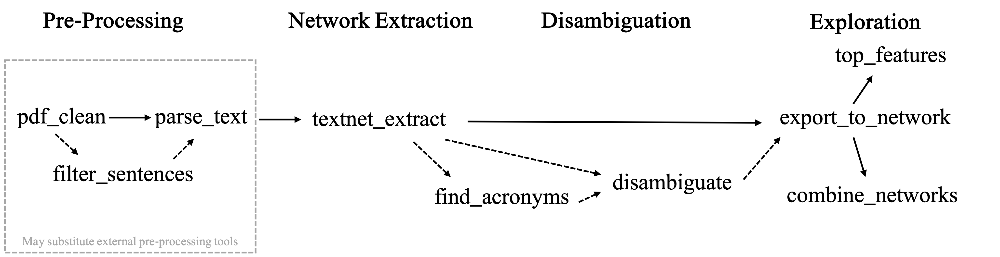
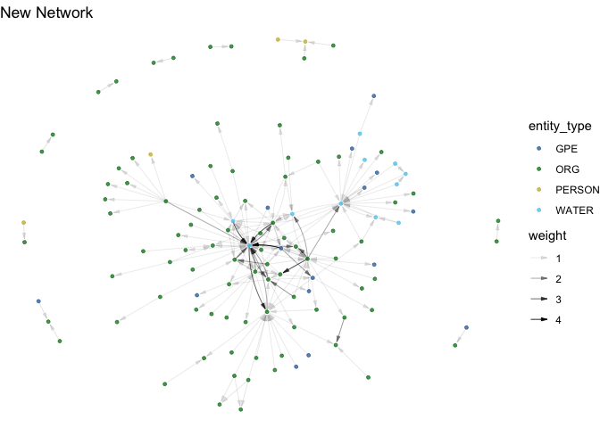

## Introduction

Network measurement in social science typically relies on data collected
through surveys and interviews. Document-based measurement is
automatable and scalable, providing opportunities for large scale or
longitudinal research that are not possible through traditional methods.
A number of tools exist to generate networks based on co-occurrence of
words within documents (such as the
[Nocodefunctions](https://nocodefunctions.com/cowo/semantic_networks_tool.html)
app [@levallois_translating_2012], the
[“textnets”](https://github.com/cbail/textnets) package [@bail_cbailtextnets_2024],
[InfraNodus](https://infranodus.com/) [@paranyushkin_infranodus_2018], and many
more). But there is, to our knowledge, no open-source tool that
generates network data based on the syntactic relationships between
entities within a sentence. *textNet* allows a user to input one or more
PDF documents and create arbitrarily complex directed, multiplex, and
multimodal network graphs, enabling rich analysis of the relationships between
verb attributes and tenses, entity types, structural motifs, and other network 
characteristics. For instance, [Zufall and Scott](https://onlinelibrary.wiley.com/doi/full/10.1111/psj.12556)
demonstrate the use of *textNet* to identify which actors are involved in start-up
versus ongoing management tasks, characterize patterns of information 
and funding flows, and compare the distribution of management tasks in networks from
regions known to have contrasting characteristics [-@zufall_syntactic_2024]. 
*textNet* also works on arbitrarily long documents, making it well suited 
for research applications using long texts such as government planning documents, 
court proceedings, regulatory impact analyses, and environmental impact assessments.

*textNet* has applications in governance network scholarship, as demonstrated by
[Zufall and Scott](https://onlinelibrary.wiley.com/doi/full/10.1111/psj.12556) 
[-@zufall_syntactic_2024] and by ongoing work on water resources governance at the 
UC Davis Center for Environmental Policy and Behavior. Additional potential 
applications include legal scholarship, social-ecological network analysis, 
government planning documents, court proceedings, archival research, communication 
and media research, and other fields interested in exploring events and entity 
relationships in textual data.

## Statement of Need

Network extraction from documents has typically required manual coding.
Furthermore, existing network extraction methods that use co-occurrence
leave a vast amount of data on the table, namely, the rich edge
attribute data and directionality of each verb phrase defining the
particular relationship between two entities, and the respective roles
of the entity nodes involved in that verb phrase. We present an R
package, *textNet*, designed to enable directed, multiplex, multimodal
network extraction from text documents through syntactic dependency
parsing, in a replicable, automated fashion for collections of
arbitrarily long documents. The *textNet* package facilitates the
automated analysis and comparison of many documents, based on their
respective network characteristics. Its flexibility allows for any
desired entity categories, such as organizations, geopolitical entities,
dates, or custom-defined categories, to be preserved.

### Directed Graph Production

As a syntax-based network extractor, *textNet* identifies source and
target nodes. This produces directed graphs that contain information
about network flow. Methods based on identifying co-occurring nodes in a
document, by contrast, produce undirected graphs. Co-occurrence graphs also have the tendency to generate saturated subgraphs, since every co-occurring collection of entities has every possible edge drawn amongst them. By contrast, *textNet* draws connections not between every entity in the document or even the sentence, but specifically between pairs of entities that are mediated by an event relationship.

### Multiplex Graph Output

Syntax-based measurement encodes edges based on subject-verb-object
relationships. *textNet* stores verb information as edge attributes,
which allows the user to preserve arbitrarily complex topological layers
(of different types of relationships) or customize groupings of edge
types to simplify representation.

### Multimodal Graph Output

Multimodal networks, or networks where there are multiple categories of
nodes, have common use cases such as social-ecological network analysis
of configurations of actors and environmental features. Existing
packages such as the manynet package [@hollway_manynet_2024] provide analytical
functions for multimodal network statistics. *textNet* provides a
structure for tagging and organizing arbitrarily complex node labeling
schemes that can then be fed into packages for multi-node network
statistical analysis. Node labels can be automated (e.g., the default
entity type tags for an NLP engine such as *spaCy* [@honnibal_spacy_2021]),
customized using a dictionary, or based on a hybrid scheme of
default and custom labels. Any node type is possible (e.g., species,
places, people, concepts, etc.) so this can be adapted to domain-specific
research applications by applying dictionaries or using a
custom NER model.

## Installation

The stable version of this package can be installed from Github, using
the *pak* package [@csardi_pak_2024]:

    pak::pak("ucd-cepb/textnet")

The *textNet* package suggests several convenience wrappers of packages
such as *spacyr* [@benoit_spacyr_2023], *pdftools* [@ooms__aut_pdftools_2024], *igraph* [@csardi_igraph_2024], and *network* [@butts_network_2023].
To use the full functionality of *textNet*, such as pre-processing tools
and post-processing analysis tools, we recommend installing these
packages, which for *spacyr* requires integration with Python. However,
the user may wish to preprocess and parse data using their own NLP
engine, and skip directly to the textnet\_extract() function, which does
not depend on *spacyr* or Python integration. 

## Overview and Main Functions

The package architecture relies on four sets of functions around core
tasks:

- \[OPTIONAL\] Pre-processing: pdf\_clean(), a wrapper for the
pdftools::pdf\_text() function which includes a custom header/footer
text removal feature; and parse\_text(), which is a wrapper for the
*spacyr* package and uses the *spaCy* natural language processing engine
[@honnibal_spacy_2021] to parse text and perform part of speech tagging, dependency
parsing, and named entity recognition (NER). Alternatively, the user can 
skip this step and load parsed text directly into the package. Externally produced data must be converted to standards
outlined in the package manual.
- Network extraction: textnet\_extract(), which generates a graph
database from parsed text based upon tags and dependency relations. The object returned
from textnet\_extract() consists of a nodelist, an edgelist with a rich set of
edge attributes, a verblist, and a list of potential coreferences for disambiguation.
- Disambiguation: tools for cleaning, recoding, and aggregating node and
edge attributes, such as the find\_acronyms() function, which can be
paired with the disambiguation() function to identify acronyms in the
text and replace them with the full entity name.
- Exploration: the export\_to\_network() function for exporting the
graph database to igraph and network objects, top\_features() for
viewing node and edge attributes, and combine\_networks() for
aggregating multiple document-based graphs based on common nodes. 

The figure below summarizes the functionality of *textNet* and the flow of function outputs. Optional data cleaning features are shown with dotted arrows.

## Potential Further Analyses
*textNet* is compatible with standard network analysis tools in R. Functionality from *ggraph* [@pedersen_ggraph_2024], *sna* [@butts_sna_2024], *igraph* [@csardi_igraph_2024], *network* [@butts_network_2023], and other network visualization 
and analysis packages can be used to further explore the extracted networks. 

The *ggraph* package has been used to create the network visualization seen here, 
using a weighted version of a igraph constructed using the "old_new_parsed" 
sample data in *textNet*. 

The network-level attributes output from export\_to\_network can also be
analyzed against exogenous metadata that has been collected separately
by the researcher regarding the different documents and their real-world
context. The extracted networks can
also be analyzed through a variety of tools, such as an Exponential
Random Graph Model or a Temporal Exponential Random Graph Model.

## Vignette

More information about the entity network extraction algorithm and an example 
start-to-finish data processing and analysis workflow can be found in the vignette 
for this package. The vignette uses sample data that travels with the *textNet* package. 

## Acknowledgements

The authors gratefully acknowledge the support of the Sustainable
Agricultural Systems program, project award no. 2021-68012-35914, from
the U.S. Department of Agriculture’s National Institute of Food and
Agriculture and the National Science Foundation’s Dynamics of Integrated
Socio-Environmental Systems program, grant no. 2205239.

## References
